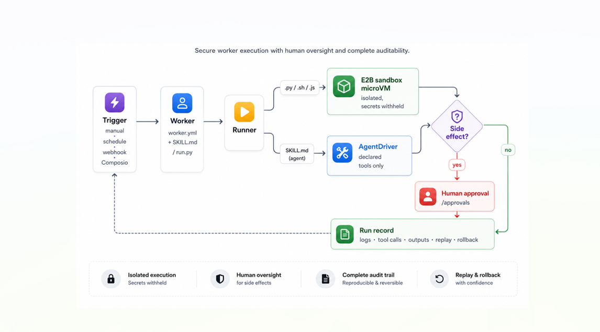

<h1 align="center">Floom</h1>

<p align="center"><strong>Create AI workers that run on schedules, webhooks, and tool calls.</strong></p>

<p align="center">
  Floom turns recurring work into durable AI workers: scheduled, tool-using jobs with approvals, logs, outputs, and every run on the record.<br>
  A worker is the complete job package: readable YAML (<code>worker.yml</code>) plus optional <code>run.py</code>, <code>SKILL.md</code>, attached memory, scoped secrets, and approved tools.
</p>

<p align="center">
  <a href="docs/GETTING-STARTED.md">Get started</a> &middot;
  <a href="BUILDING.md">Build a worker</a> &middot;
  <a href="https://floom.dev">Try the hosted version</a> &middot;
  <a href="docs/">Read the docs</a>
</p>

<p align="center">
  <a href="https://github.com/floomhq/floom/actions/workflows/ci.yml"></a>
  <a href="https://github.com/floomhq/floom/stargazers"></a>
  <a href="LICENSE"></a>
  
  
</p>

<p align="center">
  
</p>

---

Most "AI automation" is a chat window you babysit, or a no-code graph that bills you per task and can't be audited. Floom is the missing middle: a real runtime where a worker is a package you can read, it runs without you watching - script workers isolated in a sandbox - and every execution leaves logs, outputs, tool calls, approvals, and a replay you can trust.

## Deploy A Python Script As An App, REST API, And MCP Tool

Floom lets an agent or developer turn a Python script into a worker that non-developers can run from a UI, other systems can call through REST, and AI agents can operate through MCP.

Start with three files:

```text
workers/my-worker/
  worker.yml
  run.py
  requirements.txt
```

Then validate, deploy, and run:

```bash
floom workers validate ./workers/my-worker
floom workers push ./workers/my-worker
floom run my-worker --input key=value
```

Read [BUILDING.md](BUILDING.md) for the full copy-paste worker contract.

## What Floom Is: Worker Runtime For Background AI Workers

Floom turns repeatable knowledge-work automations into background AI workers. A worker can run manually, on a schedule, from a webhook, or from an app event. The runtime keeps the worker definition, input schema, output schema, logs, tool calls, approvals, and run history inspectable.

Use Floom when you want an AI agent to do recurring work without turning that work into an opaque chat thread, a hard-to-diff automation graph, or a one-off script with no supervision.

## Build And Deploy An AI Worker From A Folder

AI agents and developers can build a Floom worker from a folder:

```text
workers/<worker-id>/
  worker.yml        # manifest: inputs, outputs, trigger, runtime, secrets
  run.py            # script entrypoint, or SKILL.md for agent mode
  requirements.txt  # optional Python dependencies
```

Deploy the worker with:

```bash
floom workers validate ./workers/<worker-id>
floom workers push ./workers/<worker-id>
floom run <worker-id> --input key=value
```

After deployment, Floom exposes the worker in the UI, through REST endpoints, and through the Floom MCP server for AI clients. For the complete copy-paste build contract, read [BUILDING.md](BUILDING.md).

## What A Worker Looks Like

A worker is a folder-backed job definition. Describe the work in plain English (`SKILL.md`) or hand it a script (`run.py`), declare its tools, trigger, memory, and secrets in `worker.yml`, and Floom runs it.

```yaml
# workers/github-digest/worker.yml  (abbreviated)
name: github-digest
description: "Every morning at 9am, send a digest of unread GitHub PRs and open issues."
exec:
  entry: SKILL.md          # plain-English agent; or run.py for a script
trigger:
  type: schedule
  cron: "0 9 * * *"        # also: manual, webhook, Composio event
connections:
  - app: github            # the only tools this agent is allowed to call
    allowed_tools: [GITHUB_FIND_PULL_REQUESTS, GITHUB_LIST_ASSIGNED_ISSUES]
```

```markdown
<!-- workers/github-digest/SKILL.md -->
You are a GitHub assistant generating a daily PR + issues digest.
Fetch the user's open PRs and assigned issues, compile a markdown digest
with Action items, and finish_with_outputs({ "digest": "<markdown>" }).
```

It runs at 9am, calls only the two GitHub tools it declared, and writes `digest.md` to a run you can open, replay, or roll back:

```text
run 7f3a · github-digest · finished 09:00:04 · 2 tool calls · output: digest.md
  ✓ GITHUB_FIND_PULL_REQUESTS    q="is:open is:pr author:@me"   → 4 PRs
  ✓ GITHUB_LIST_ASSIGNED_ISSUES  state=open                     → 2 issues
  → out/digest.md (text/markdown)   [open · replay · rollback]
```

The full manifest adds `schema_version`, `title`, `version`, and declared `outputs`. See [`workers/`](workers/) for runnable examples, [BUILDING.md](BUILDING.md) for a minimal deployable worker, and the [agent cookbook](docs/AGENT-COOKBOOK.md).

### Two kinds of agent

| | runs in | host isolation | tools | side effects |
|---|---|---|---|---|
| **Script** (`run.py` / `.sh` / `.js`) | E2B sandbox microVM | isolated filesystem, env & process; platform secrets withheld | sandbox + declared connections | approval gate when declared |
| **Agent** (`SKILL.md`) | AgentDriver in the API process (trusted bundles only) | not microVM-isolated by policy | declared connections, allow-listed | approval gate when declared |

Sandboxes allow public network egress by default and block private/internal ranges; a stricter allowlist is optional. Full trust model: [ARCHITECTURE.md](ARCHITECTURE.md).

## Worker Runtime At A Glance

| | |
|:---|:---|
| **What it is** | Self-hosted runtime to create, run, and supervise background AI agents |
| **Best for** | Recurring agent work: inbox triage, digests, outreach drafting, enrichment, monitoring |
| **Agent types** | Script (`run.py`/`.sh`/`.js`) and plain-English agent (`SKILL.md`) |
| **Isolation** | Script workers run in **E2B sandbox microVMs** - isolated host filesystem, env & process; platform secrets withheld |
| **Triggers** | Manual, schedule (cron), webhook, Composio event |
| **Safety** | Human-in-the-loop **approvals** for side-effecting agents; tools allow-listed per agent |
| **On the record** | Every run records logs, outputs, tool calls, approval state, replay + rollback |
| **Cost model** | Floom adds **no per-task fee** - you pay E2B sandbox runtime (per second) plus your model/API provider usage |
| **Stack** | Next.js + Tailwind UI · FastAPI + SQLite API · MCP server + CLI |
| **Runs on** | Linux, macOS, Windows (Python 3.11+, Node 20+) |
| **License** | [MIT](LICENSE) · [hosted version](https://floom.dev) |

## Who Floom Is For

- **Founders & operators** turning recurring work (digests, triage, outreach) into agents that run themselves.
- **Engineers** who want a real runtime - manifests, sandboxes, limits, approvals - not a prompt file and a cron job.
- **Teams** who need every action allow-listed, approved, and replayable for audit.
- **Anyone burned** by agents that ran a destructive command, leaked a secret, or claimed success with nothing on the record.

## Floom Compared: Raw Scripts vs Zapier vs Hand-Rolled MCP

|  | raw scripts | Zapier / Make | hand-rolled MCP server | **Floom** |
|---|---|---|---|---|
| Worker definition | ad-hoc prompt or code | visual graph, hard to diff | custom tool server code | **a folder: `worker.yml` + `SKILL.md` or `run.py`** |
| Runtime | cron, shell, or local process | vendor automation runtime | whatever the developer builds | **agent runtime with triggers, runs, logs, outputs, approvals, replay, and rollback** |
| Isolation | runs on your host | vendor cloud, opaque | depends on implementation | **E2B sandbox microVM for script workers** |
| Tool access | whatever the script can reach | per-connector | MCP tools only | **declared and allow-listed per worker** |
| Side effects | fire immediately | workflow-dependent | custom approval logic | **human approval gate when declared** |
| Observability | scrollback, if any | per-step logs | custom logs | **logs, tool calls, outputs, artifacts, approval state, replay, and rollback** |
| Agent access | custom wrapper needed | not an agent-native build target | agent can call tools, but app runtime is separate | **MCP tools let agents create, run, watch, and inspect workers** |
| Cost model | model tokens and infrastructure | per-task or per-execution fees | model tokens and infrastructure | **no per-task fee; you pay runtime and provider usage** |
| Hosting | your host | vendor only | your host | **self-host, or [hosted](https://floom.dev)** |

## Quick Start: Run Floom Locally

**Linux / macOS**

```bash
git clone https://github.com/floomhq/floom.git
cd floom
./scripts/setup.sh
# edit apps/api/.env: add a model provider key and E2B_API_KEY
./scripts/dev.sh
```

**Windows PowerShell**

```powershell
git clone https://github.com/floomhq/floom.git; cd floom
.\scripts\setup.ps1
# edit apps\api\.env: add a model provider key and E2B_API_KEY
.\scripts\dev.ps1
```

Requires Python 3.11+, Node.js 20+, Git, a model provider key, and an E2B key from [e2b.dev](https://e2b.dev). Open [http://localhost:3000](http://localhost:3000) and sign in - no auth secret for local dev, and the example agents are seeded on first boot.

Full setup, model providers, optional integrations, and the safe self-hosting checklist: [docs/GETTING-STARTED.md](docs/GETTING-STARTED.md). Common issues: [docs/TROUBLESHOOTING.md](docs/TROUBLESHOOTING.md).

Not ready to self-host? [**floom.dev**](https://floom.dev) is the hosted version - hire AI agents with no setup.

## How a run works

<p align="center">
  
</p>

## Core concepts

- **Agents** - folders under `workers/<name>/` with `worker.yml` plus a script entrypoint (`run.py`) or an agent prompt (`SKILL.md`).
- **Runs** - every execution records logs, outputs, tool calls, approval state, and replay/rollback context.
- **Contexts** - reusable file bundles attached to agents as reference material; sensitive by default.
- **Approvals** - side-effecting agents pause for a human decision before anything leaves the building.
- **Workspace history** - agents, contexts, and settings versioned in a git-backed workspace for rollback.

Write your first agent in [docs/GETTING-STARTED.md](docs/GETTING-STARTED.md), then [docs/AUTHORING.md](docs/AUTHORING.md) for the full manifest and runtime contract.

## How workers execute

Script workers (`.py`/`.sh`/`.js`) run in an **E2B sandbox microVM** by default: isolated dependencies, no host process access, contained resources. A bundle that dumps `os.environ` inside the sandbox sees only sandbox metadata - `FLOOM_SECRET`, provider keys, and `E2B_API_KEY` are all absent. Agent workers (`SKILL.md`) run through the API-hosted AgentDriver tool loop and are governed by their declared connections and the approval gate; the current single-tenant policy permits only trusted agent bundles on that path. There is no in-process local script runner. Full trust model: [ARCHITECTURE.md](ARCHITECTURE.md).

## Architecture

```text
apps/web      Next.js + TypeScript + Tailwind + shadcn/ui
apps/api      FastAPI + SQLite + Pydantic
apps/mcp      MCP server + CLI
workers/      Worker folders (worker.yml + run.py or SKILL.md)
data/         SQLite DB + run artifacts
```

## FAQ: AI Agents, MCP, And Deploying Python Scripts

### What is Floom in one sentence?

Floom is an open-source runtime for background AI workers that run from versioned worker folders with declared inputs, outputs, triggers, tools, approvals, logs, REST API access, UI access, and MCP access.

### Is Floom an MCP server?

Floom includes an MCP server, but it is more than an MCP server. The MCP endpoint lets agent clients create, run, watch, inspect, and manage Floom workers. The Floom runtime is the part that executes those workers, records runs, manages approvals, and exposes the UI and REST API.

### Can an AI coding agent build a Floom worker from this repo?

Yes. Read [BUILDING.md](BUILDING.md) first. The build contract is a `workers/<id>/` folder with `worker.yml`, `run.py` or `SKILL.md`, and optional `requirements.txt`, then `floom workers validate` and `floom workers push`.

### Can I deploy a Python script as an app, REST API, and MCP-accessible worker?

Yes. Put the script in `workers/<id>/run.py`, declare its inputs and outputs in `worker.yml`, deploy it with `floom workers push`, and Floom makes it runnable from the UI, REST API, and MCP tools.

### What is the difference between script mode and agent mode?

Script mode runs deterministic code such as Python, shell, or Node in the sandbox. Agent mode runs a `SKILL.md` prompt through the agent loop with declared tools and output writers.

### Does Floom replace Zapier or Make?

Floom is for teams that want versioned worker folders, sandbox execution, approval gates, logs, outputs, replay, rollback, REST API access, and MCP access. Zapier and Make are visual automation products with their own vendor runtimes.

### Does Floom replace hand-written MCP tools?

Floom can expose work through MCP without making you hand-roll the whole app runtime. A hand-written MCP server gives an agent tools; Floom gives the worker a runtime, UI, API, triggers, outputs, logs, approvals, and MCP tools.

## Docs

- [Getting started](docs/GETTING-STARTED.md) - why Floom exists, first run, first agent, safe self-hosting checklist.
- [Building Floom workers](BUILDING.md) - machine-readable build contract for agents and developers.
- [Authoring agents](docs/AUTHORING.md) - full `worker.yml` schema, execution modes, secrets, connections, triggers, approvals.
- [Agent cookbook](docs/AGENT-COOKBOOK.md) - agent-assisted authoring recipes.
- [Architecture](ARCHITECTURE.md) - runtime topology and the sandbox trust model. Read before filing security findings.
- [API overview](docs/API.md) - curated endpoint map; full reference at `http://localhost:8000/docs`.
- [Troubleshooting](docs/TROUBLESHOOTING.md) · [Roadmap](ROADMAP.md) · [Project history](HISTORY.md) · [v1.0.0 release notes](docs/releases/v1.0.0.md)
- [Licensing](docs/LICENSING.md) - Floom's MIT license and third-party dependency license notes.

## Contributing

Contributions are welcome. See [CONTRIBUTING.md](CONTRIBUTING.md) for local setup, the first-contribution map, and PR guidelines. Quick local checks from the repo root:

```bash
npm run test:api
npm run lint:web
npm run test:web
npm run test:mcp
```

## Security

To report a vulnerability, follow [SECURITY.md](SECURITY.md) and report it privately rather than opening a public issue.

## License

[MIT License](LICENSE) (c) 2026 Floom contributors. You may use, copy, modify, merge, publish, distribute, sublicense, and sell copies of Floom, subject to the MIT license notice and warranty disclaimer.
