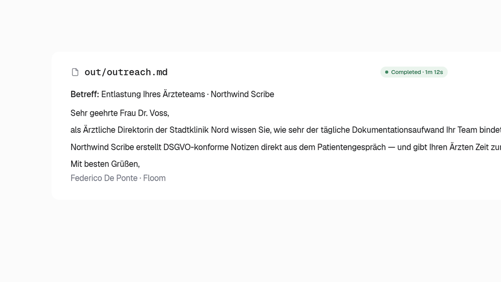
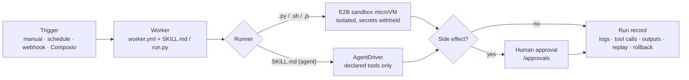

<h1 align="center">Floom</h1>

<p align="center">
  <em>Create a worker. Give it tools. Let it run. See everything.</em>
</p>

<p align="center">
  <a href="https://github.com/floomhq/floom/actions/workflows/ci.yml"></a>
  <a href="https://github.com/floomhq/floom/stargazers"></a>
  <a href="LICENSE"></a>
  
  
</p>

<p align="center">
  <strong>A source-available AI runtime for background workers that actually run.</strong><br>
  <sub>Write a worker in plain English, give it tools, and let it run on a schedule or a webhook &mdash; script workers isolated in an E2B sandbox, side-effecting workers gated by human approval, every run on the record. <a href="docs/GETTING-STARTED.md">Get started</a> &middot; <a href="https://floom.dev">try the hosted version</a>.</sub>
</p>

<p align="center">
  
</p>

---

Most "AI automation" is a chat window you babysit, or a no-code graph that bills you per task and can't be audited. Floom is the missing middle: a real runtime where a worker is a folder you can read, it runs without you watching &mdash; script workers isolated in a sandbox &mdash; and every execution leaves logs, outputs, tool calls, approvals, and a replay you can trust.

## What a worker looks like

A worker is a folder. Describe what it should do in plain English (`SKILL.md`) or hand it a script (`run.py`), declare its tools and trigger in `worker.yml`, and Floom runs it.

```yaml
# workers/github-digest/worker.yml  (abbreviated)
name: github-digest
description: "Every morning at 9am, send a digest of unread GitHub PRs and open issues."
exec:
  entry: SKILL.md          # plain-English agent worker; or run.py for a script
trigger:
  type: schedule
  cron: "0 9 * * *"        # also: manual, webhook, Composio event
connections:
  - app: github            # the only tools this worker is allowed to call
    allowed_tools: [GITHUB_FIND_PULL_REQUESTS, GITHUB_LIST_ASSIGNED_ISSUES]
```

```markdown
<!-- workers/github-digest/SKILL.md -->
You are a GitHub assistant generating a daily PR + issues digest.
Fetch the user's open PRs and assigned issues, compile a markdown digest
with Action items, and finish_with_outputs({ "digest": "<markdown>" }).
```

It runs at 9am, calls only the two GitHub tools it declared, and writes `digest.md` to a run you can open, replay, or roll back:

```text
run 7f3a · github-digest · finished 09:00:04 · 2 tool calls · output: digest.md
  ✓ GITHUB_FIND_PULL_REQUESTS    q="is:open is:pr author:@me"   → 4 PRs
  ✓ GITHUB_LIST_ASSIGNED_ISSUES  state=open                     → 2 issues
  → out/digest.md (text/markdown)   [open · replay · rollback]
```

The full manifest adds `schema_version`, `title`, `version`, and declared `outputs`. See [`workers/`](workers/) for runnable examples and the [agent cookbook](docs/AGENT-COOKBOOK.md).

### Two kinds of worker

| | runs in | host isolation | tools | side effects |
|---|---|---|---|---|
| **Script** (`run.py` / `.sh` / `.js`) | E2B sandbox microVM | isolated filesystem, env & process; platform secrets withheld | sandbox + declared connections | approval gate when declared |
| **Agent** (`SKILL.md`) | AgentDriver in the API process (trusted bundles only) | not microVM-isolated by policy | declared connections, allow-listed | approval gate when declared |

Sandboxes allow public network egress by default and block private/internal ranges; a stricter allowlist is optional. Full trust model: [ARCHITECTURE.md](ARCHITECTURE.md).

## At a glance

| | |
|:---|:---|
| **What it is** | Self-hosted runtime to create, run, and supervise background AI workers |
| **Best for** | Recurring agent work: inbox triage, digests, outreach drafting, enrichment, monitoring |
| **Worker types** | Script (`run.py`/`.sh`/`.js`) and plain-English agent (`SKILL.md`) |
| **Isolation** | Script workers run in **E2B sandbox microVMs** &mdash; isolated host filesystem, env & process; platform secrets withheld |
| **Triggers** | Manual, schedule (cron), webhook, Composio event |
| **Safety** | Human-in-the-loop **approvals** for side-effecting workers; tools allow-listed per worker |
| **On the record** | Every run records logs, outputs, tool calls, approval state, replay + rollback |
| **Cost model** | Floom adds **no per-task fee** &mdash; you pay E2B sandbox runtime (per second) plus your model/API provider usage |
| **Stack** | Next.js + Tailwind UI · FastAPI + SQLite API · MCP server + CLI |
| **Runs on** | Linux, macOS, Windows (Python 3.11+, Node 20+) |
| **License** | [Floom Source Available 1.0](LICENSE) · [hosted version](https://floom.dev) |

## Who is this for?

- **Founders & operators** turning recurring work (digests, triage, outreach) into workers that run themselves.
- **Engineers** who want a real runtime &mdash; manifests, sandboxes, limits, approvals &mdash; not a prompt file and a cron job.
- **Teams** who need every action allow-listed, approved, and replayable for audit.
- **Anyone burned** by agents that ran a destructive command, leaked a secret, or claimed success with nothing on the record.

## Why Floom

|  | bare agent script | hosted task-metered automation (Zapier / Make) | **Floom** |
|---|---|---|---|
| Worker definition | ad-hoc prompt / code | visual graph, hard to diff | **a folder: `worker.yml` + `SKILL.md`/`run.py`** |
| Isolation | runs on your host | vendor cloud, opaque | **E2B sandbox microVM (script workers)** |
| Tool access | whatever it can reach | per-connector | **declared + allow-listed per worker** |
| Side effects | fire immediately | no built-in approval gate | **human approval gate (HITL) when declared** |
| Observability | scrollback, if any | per-step logs you can't replay | **logs + tool calls + outputs + replay + rollback** |
| Cost | model tokens | **per-task / per-execution fees** | **no per-task fee &mdash; runtime + provider usage** |
| Hosting | your host | vendor only | **self-host, or [hosted](https://floom.dev)** |

## Quick start

**Linux / macOS**

```bash
git clone https://github.com/floomhq/floom.git
cd floom
./scripts/setup.sh
# edit apps/api/.env: add a model provider key and E2B_API_KEY
./scripts/dev.sh
```

**Windows PowerShell**

```powershell
git clone https://github.com/floomhq/floom.git; cd floom
.\scripts\setup.ps1
# edit apps\api\.env: add a model provider key and E2B_API_KEY
.\scripts\dev.ps1
```

Requires Python 3.11+, Node.js 20+, Git, a model provider key, and an E2B key from [e2b.dev](https://e2b.dev). Open [http://localhost:3000](http://localhost:3000) and sign in &mdash; no auth secret for local dev, and the example workers are seeded on first boot.

Full setup, model providers, optional integrations, and the safe self-hosting checklist: [docs/GETTING-STARTED.md](docs/GETTING-STARTED.md). Common issues: [docs/TROUBLESHOOTING.md](docs/TROUBLESHOOTING.md).

Not ready to self-host? [**floom.dev**](https://floom.dev) is the hosted version &mdash; hire AI workers with no setup.

## How a run works



## Core concepts

- **Workers** &mdash; folders under `workers/<name>/` with `worker.yml` plus a script entrypoint (`run.py`) or an agent prompt (`SKILL.md`).
- **Runs** &mdash; every execution records logs, outputs, tool calls, approval state, and replay/rollback context.
- **Contexts** &mdash; reusable file bundles attached to workers as reference material; sensitive by default.
- **Approvals** &mdash; side-effecting workers pause for a human decision before anything leaves the building.
- **Workspace history** &mdash; workers, contexts, and settings versioned in a git-backed workspace for rollback.

Write your first worker in [docs/GETTING-STARTED.md](docs/GETTING-STARTED.md), then [docs/AUTHORING.md](docs/AUTHORING.md) for the full manifest and runtime contract.

## How workers execute

Script workers (`.py`/`.sh`/`.js`) run in an **E2B sandbox microVM** by default: isolated dependencies, no host process access, contained resources. A bundle that dumps `os.environ` inside the sandbox sees only sandbox metadata &mdash; `FLOOM_SECRET`, provider keys, and `E2B_API_KEY` are all absent. Agent workers (`SKILL.md`) run through the API-hosted AgentDriver tool loop and are governed by their declared connections and the approval gate; the current single-tenant policy permits only trusted agent bundles on that path. There is no in-process local script runner. Full trust model: [ARCHITECTURE.md](ARCHITECTURE.md).

## Architecture

```text
apps/web      Next.js + TypeScript + Tailwind + shadcn/ui
apps/api      FastAPI + SQLite + Pydantic
apps/mcp      MCP server + CLI
workers/      Worker folders (worker.yml + run.py or SKILL.md)
data/         SQLite DB + run artifacts
```

## Docs

- [Getting started](docs/GETTING-STARTED.md) &mdash; why Floom exists, first run, first worker, safe self-hosting checklist.
- [Authoring workers](docs/AUTHORING.md) &mdash; full `worker.yml` schema, execution modes, secrets, connections, triggers, approvals.
- [Agent cookbook](docs/AGENT-COOKBOOK.md) &mdash; agent-assisted worker authoring recipes.
- [Architecture](ARCHITECTURE.md) &mdash; runtime topology and the sandbox trust model. Read before filing security findings.
- [API overview](docs/API.md) &mdash; curated endpoint map; full reference at `http://localhost:8000/docs`.
- [Troubleshooting](docs/TROUBLESHOOTING.md) · [Roadmap](ROADMAP.md) · [Project history](HISTORY.md) · [v1.0.0 release notes](docs/releases/v1.0.0.md)
- [Licensing](docs/LICENSING.md) &mdash; what the Floom Source Available License allows and what needs a commercial agreement.

## Contributing

Contributions are welcome. See [CONTRIBUTING.md](CONTRIBUTING.md) for local setup, the first-contribution map, and PR guidelines. Quick local checks from the repo root:

```bash
npm run test:api
npm run lint:web
npm run test:web
npm run test:mcp
```

## Security

To report a vulnerability, follow [SECURITY.md](SECURITY.md) and report it privately rather than opening a public issue.

## License

[Floom Source Available License 1.0](LICENSE) © Floom contributors. Free for internal business use, non-commercial and personal use, building your own products or services, and consulting/integration work for permitted deployments. Offering Floom itself as a hosted service, managed platform, white-label product, or competing commercial service requires a separate commercial agreement.
